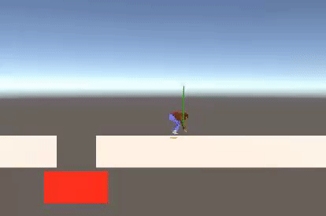

# Unity-Tools
This project aims to centralize the various tools I develop under Unity. 
If there are things you can use, use it for free (under MIT license).

## ✦ Overview
The tools are designed to speed up iteration time for a better workflow efficiency. Most of them are independent but there is usually a common base (found in the Core/ folder). 

## ✦ Features

###  Architecture
* **Scriptable Object architecture** (inspired by the Ryan Hipple Game Architecture with Scriptable Objects conference: https://www.youtube.com/watch?v=raQ3iHhE_Kk)

### Tools
* **UE4-like Blackboard**: A class allowing to store an array of variables by entities. This allows information to be transmitted through multiple components while reducing their coupling.
* **Finite State Machine** inspector framework (FSMState, FSMStateTransition, FSMStateTransitionCondition, FSMStateModule):
Allows to design multiple states from the editor without using code (or very little).                                     
       
*Finite State Machine and blackboard sample*       
       
*Demo of a character locomotion + animations made with the Finite State Machine*

* **Sensors** (Raycast Utility to use raycast from asset descriptors, ...)
* **Procedural action system** (for 2D action games): Allowing to combine various tweakable actions (Hitbox for damage, Momentum for movement, StatModifier, Combo Sequence, ...)                                                               
                                          
*A prototype made with the procedural action system*

### Advanced Editor Utility
* **Advanced Editor Utility** (Animation, Input management, MinMaxRange, Physcis...)
* **GUI attributes** to extend the editor (such as ReadOnly or LayerMask).

### WIP

* **Custom Navmesh**: I wanted to try to make a navmesh to improve my geometry understanding.

